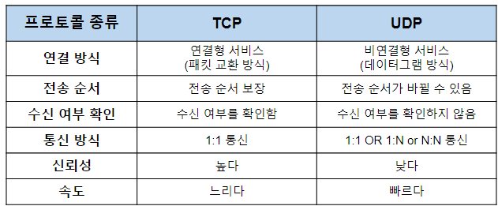
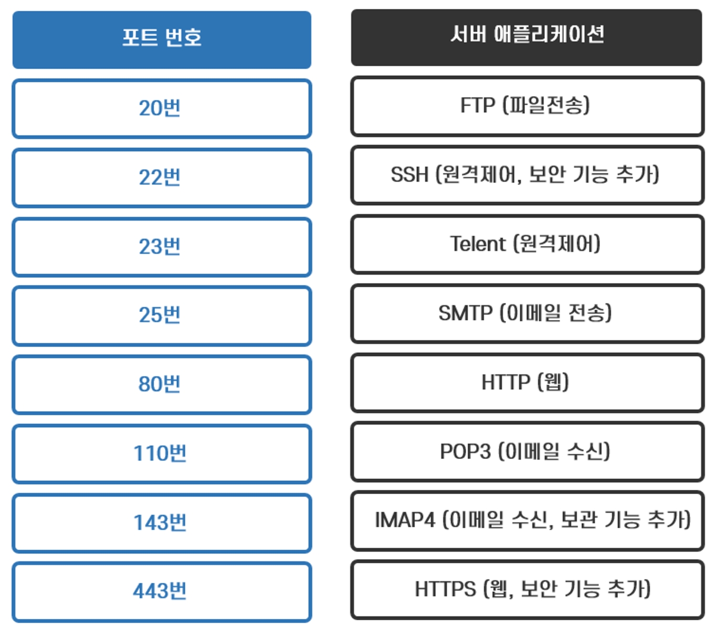
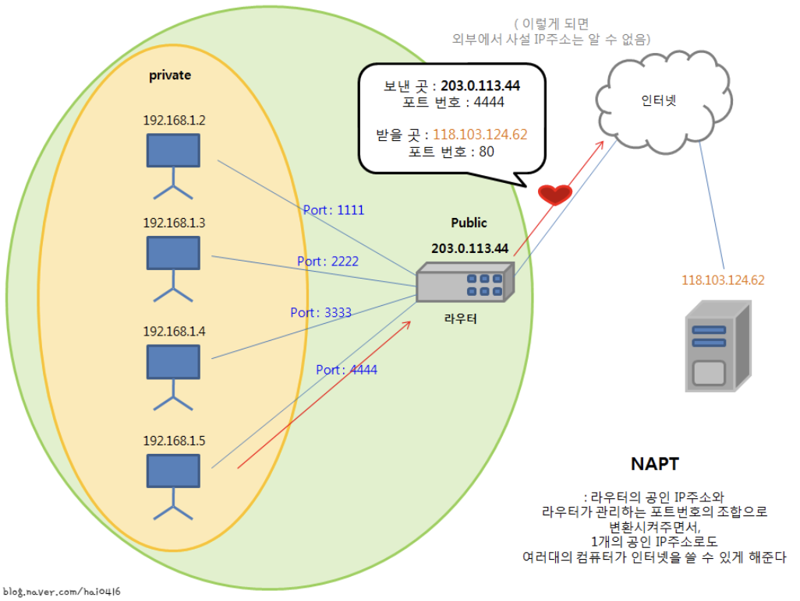
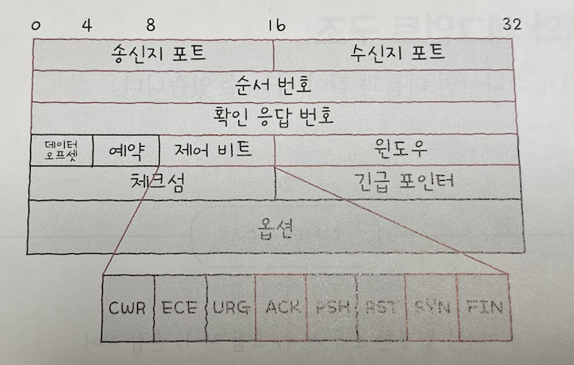
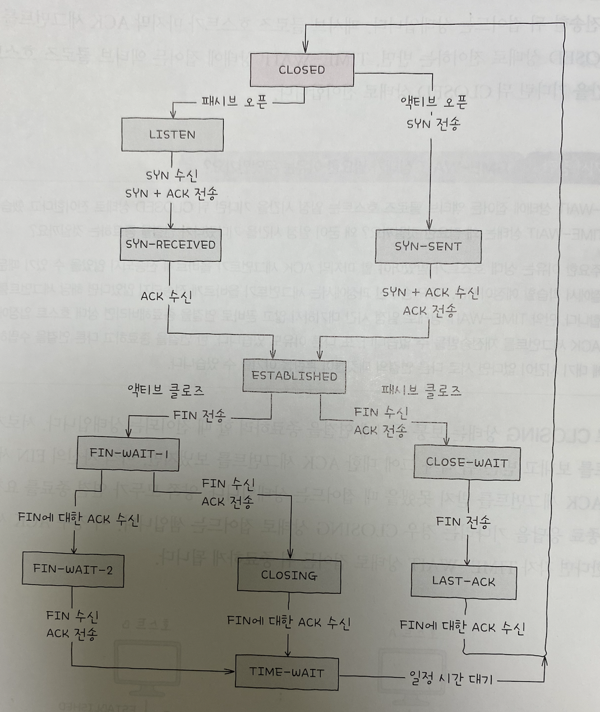
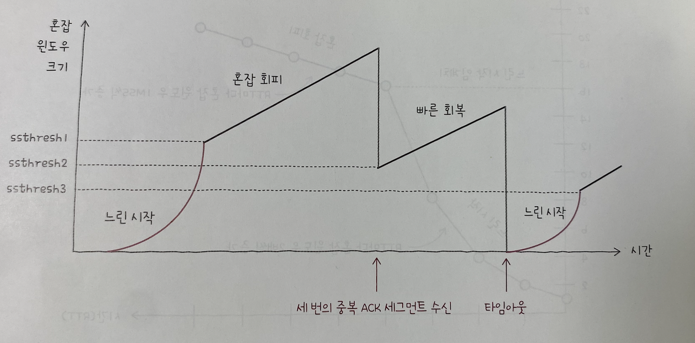

# 04 전송계층

# 04-1 전송 계층 개요: IP의 한계와 포트 (190p)

<aside>
☑️ 응용 계층

</aside>

<aside>
✅ 전송 계층

</aside>

<aside>
☑️ 네트워크 계층

</aside>

<aside>
☑️ 데이터 링크 계층

</aside>

<aside>
☑️ 물리 계층

</aside>

<aside>
 전송 계층이란?

</aside>

<aside>
 네트워크 계층과 응용 계층 사이에 위치해 있는 계층이다.

신뢰할 수 있는 통신과 연결형 통신을 가능하게 하고, 포트 번호를 통해 응용 계층의 애플리케이션 프로세스들을 식별하는 역할을 수행한다.

간단히 말하면 네트워크 계층의 한계를 보완하고 응용 계층과의 연결점을 제공하는 계층이다.

</aside>

## 신뢰할 수 없는 통신과 비연결형 통신

---

네트워크 계층의 핵심 프로토콜인 IP는 IP단편화 IP주소 지정, 두 가지로 이야기 할 수 있지만 이 외에도 IP의 한계라고 볼 수 있는 두 가지 중요한 특징이 있다.

1. 신뢰할 수 없는 (비신뢰성)프로토콜
2. 비연결형 프로토콜

정리해 다시 얘기하면

- 신뢰성이 없는 통신이자 연결을 수립하는 과정이 없는 통신

### 신뢰할 수 없는 통신(최선형 전달)

<aside>
📌 IP프로토콜이 패킷이 수신지까지 제대로 전송되었다는 보장을 하지 않음

- 통신 과정에서 패킷의 데이터가 손상되거나 중복된 패킷이 전송되었더라도 이를 확인하지 않고, 재전송도 하지 않으며, 순서대로 패킷이 도착할 것이라도 보장도 하지 않는다는 의미
- 최선형 전달: 최선을 다해보겠지만, 전송결과에 대해서는 어떠한 보장도 하지 않겠다.
</aside>

### 비연결형 통신

<aside>
📌 송수신 호스트간에 사전 연결 수립 작업을 거치지 않는 특징을 의미

그저 수신지를 향해 패킷을 보낼 뿐

<aside>
 왜 신뢰할 수 없는 비연결형 통신을 하나요?

</aside>

<aside>
 성능때문입니다.

모든 패킷이 제대로 전송되었는지 일일이 확인하고, 호스트간 연결을 수립하는 작섭은 패킷의 ‘빠른’ 송수신과는 먼 작업이고, 더 많은 시간과 대역폭, 부하가 요구되어 성능상 악영향으로 이어짐

</aside>

</aside>

## IP의 한계를 보완하는 전송계층

---

### 1. 전송 계층은 연결형 통신을 가능하게 함

<aside>
1️⃣ 대표적으로 TCP, TCP는 지난 번에 배웟던 회선 교환 네트워크와 유사하게 두 호스트가 정보를 주고받기 전에 마치 가상의 회선을 설정하듯이 연결을 수립함. 송수신하는 동안 연결을 유지하고, 송수신이 끝나면 연결을 종료함

</aside>

### 2. 전송 계층은 신뢰성 있는 통신을 가능하게 함

<aside>
2️⃣ **TCP와 UDP**

TCP를 통해 신뢰성있는 통신또한 가능. TCP는 패킷이 올바를 순서대로 확실히 전달되는 것을 보장하기 위해 재전송을 통한 오류제어, 흐름제어, 혼잡제어 등 다양한 기능들을 제공

연결성통신과 신뢰성 있는 통신이 그렇지 않는 통신에 비해 무조건적으로 좋은것만은 아님. 때로는 비교적 높은 성능을 위해 신뢰할 수 없는 통신, 비연결형 통신이 필요할 때가 있음.

그래서 UDP가 존재. UDP는 신뢰할 수 없는 통신, 비연결형 통신을 가능하게 하는 전송계층의 프로토콜이면 TCP보다 비교적 빠른 전송이 가능하다

</aside>

## 응용 계층과의 연결 다리, 포트

---

응용계층의 연결 다리 역할로서의 전송계층을 살펴보자

### 포트의 정의

<aside>
📌 패킷은 컴퓨터에 도달하면 수신이 끝나는 것이 아니다.
특정 애플리케이션 프로세스까지 전달되어야만 한다.

패킷을 전송할때도 마찬가지.
결국 패킷의 최종 수신 대상은 특정 애플리케이션 프로세스다.

<aside>
 프로세스란?

</aside>

<aside>
 프로세스는 실행 중인 프로그램을 의미한다.

프로그램은 실행되기전까지 보조기억장치에 저장된 데이터 덩어리일 뿐이지만, 프로그램이 실행되는 순간 프로세스가 되어 메인 메모리에 적재된다.

각 프로세스는 PID(Process ID)라는 번호로 식별된다. PID는 학교의 학번이나 회사의 사번처럼 프로세스의 고유한 식별 정보를 뜻한다.

포트란, 패킷에 포함되어있는 **특정 애플리케이션을 식별할 수 있는 정보**를 뜻합니다.

</aside>

</aside>

### 포트의 분류

<aside>
📌 전송계층에서는 포트 번호를 통해 특정애플리케이션을 식별한다.

TCP와 UDP는 모두 포트번호 핑드인 송신지 포트번호와 수신지 포트번호를 포함한다.

포트번호는 16비트로 표현가능하며, 사용 가능한 포드의 수는 2^16(65536)개이다.

| 잘 알려진 포트/
시스템포트 | 등록된 포트 | 동적포트/
사설포트/
임시포트 |
| --- | --- | --- |
| 0 | 1024 (2^10) | 49152 (2^14+2^15) |
| 1023 | 49151 | 65535 |

서버로서 동작하는 프로그램은 일반적으로 잘 알려진 포트와 등록된 포트로 동작하는 경우가 많다. 즉, 서버로서 동작하는 프로그램의 포트 번호는 사전에 암묵적으로 정해진 경우가 많다는 것이다. 반면 클라이언트로서 동작하는 프로그램은 동적 포트 번호 중 임의의 번호가 할당되는 경우가 많다. 대표적으로 웹 브라우저가 있다.

IP주소와 포트 번호에 대한 정보가 함께 주어지면 **특정 호스트에서 실행 중인 특정 애플리케이션 프로세스**를 식별할 수 있다. 그래서 포트 번호는 일반적으로 **IP 주소:포트 번호** 형식으로 IP주소와 함께 표기되는 경우가 많다.

e.g. 192.168.0.15:8000
           ip 주소       : 포트번호(애플리케이션 프로세스 식별)

<aside>
💡 정리!

전송계층은 신뢰할 수 있는 연결형 통신이 가능한 프로토콜(TCP)를 제공하기에 네트워크 계층의 한계를 보완할 수 있고, 포트를 통해 응용 계층의 애플리케이션을 식별함으로써 응용계층과의 연경다리 역할을 수행한다.

</aside>

</aside>

## 포트 기반 NAT

---

NAT란? IP주소를 변호나하는 기술, 주로 네트워크 내부에서 사용되는 사설 ip주소와 네트워크 외부에서 사용되는 공인 ip주소를 변환하는 데 사용됨. 이런 변환을 위해 주로 사용되는 것이 **NAT 변환 테이블**이다.

### NAT 변환 테이블

<aside>
📌 예시

| 네트워크 외부 | 네트워크 내부 |
| --- | --- |
| 1.2.3.4 | 192.168.0.5 |
| 1.2.3.5 | 192.168.0.6 |
1. 네트워크 내부에 192.168.0.5라는 사설 ip주소를 가진 호스트가 있고, 수신지 주소가 10.11.12.13인 네트워크 외부의 호스트에서 패킷을 전송한다고 가정해보자
2. 패킷이 NAT기능을 갖춘 라우터를 거쳐 네트워크 외부로 나가게 되면 패킷의 송신지 주소는 네트워크 외부에서 사용되는 공인 ip주소인 1.2.3.4가 된다
3. 반대의 경우, 수신지 주소거 1.2.3.4인 패킷이 네트워크 외부에서 네트워크 내부로 전송되는 상황일때
4. 이 패킷의 수신지 주소는 NAT 라우터를 거쳐 192.168.0.5가 된다.

NAT테이블의 항목을 일대일로 대응해 NAT를 활용하는 것이 가능하지만, 이 방식 만으로 만으로 사설 ip주소를 변환하기에는 무리가 있다. 그러려면 사설ip주소의 수만큼 공인 ip주소가 필요하기 때문

오늘날엔 뎁븐 디승,; 시살 ip주소를 그보다 적은 수의 적은 수의 공인 ip주소로 변환한다. 그것이 어떻게 가능하냐!? 여기서 바로 포트가 활용된다.

</aside>

### NAPT(Network Address Port Translation)

<aside>
📌 포트 기반의 NAT를 NAPT라 함. APT라고 부르기도 함. NAPT는 포트를 활용해 하나의 공인 ip주소를 여러 사설 ip 주소가 공유할 수 있도록 하는 NAT의 일종. NAPT는 NAT테이블에 변환할 ip주소 쌍과 더불어 포트 번호도 함께 기록하고, 변환함. 같은 1.2.3.4라는 공인 ip주소로 변환되더라도 포트 번호 6200번으로 변환되느냐, 6201로 변환되느냐에 따라 내부 ip주소를 구불지을 수 있다.

| 네트워크 외부 | 네트워크 내부 |
| --- | --- |
| 1.2.3.4:6200 | 192.168.0.5:1025 |
| 1.2.3.4:6201 | 192.168.0.6:1026 |

이처럼 네트워크 외부에서 사용할 ip주소가 같더라도 포트 번호가 다르면 네트워크 내부의 호스트를 특정할 수 있기때문에, 다수의 사설 ip주소를 그보다 적은 수의 공인 ip 주소로 변환할 수 있게 된다. 즉N:1로 관리할 수 있는 것이다. 이러한 점에서 NAPT는 공인 ip주소 수 부족 문제를 개선할 기술로도 간주된다.

NAPT / PAT(Port Adress Translation)

<aside>
💡 정리!

NAPT는 NAT + Port

</aside>

</aside>

### (더 알아보기)

<aside>
🤔 **더 알아보기**

포트 포워딩(Port Forwarding)

네트워크 내 특정 호스트에 ip주소와 포트 번호를 미리 할당하고, 해당 ip주소:포트번호로써 해당 호스트에게 패킷을 전달하는 기능

처음 패킷을 보내는 네트워크 외부 호스트 입장에서는 어떤 ip주소(및 포트)를 수신지 주소로 삼을지 결정하기 어려울 수 있다. 이 때 사용되는 것이 포트 포워딩이다. 특정 ip 주소와 포트 번호 쌍을 특정 호스트에게 할당한 뒤, 외부에서 통신을 시작할 호스트에게 해당 접속 정보(ip 주소:포트 번호로 통신을 시작할 수 있다. 이처럼 포트 포워딩은 주로 네트워크 외부에서 네트워크 내부로 통신을 시작할 때, 네트워크 내부의 서버를 외부에서 접속할 수 있도록 접속 정보를 공개하기 위해 자주 사용된다.

</aside>

<aside>
🤔 **더 알아보기**

ICMP(Internet Control Message Protocol)

ip의 신회할 수 없는 전송특성과 비연결형 전송 특성을 보완하기 위한 네트워크 계층의 프로토콜로 ICMP가 있다. 

ICMP란?
ip 패킷의 전송과정에 대한 피드백 메시지를 얻기위해 사용하는 프로토콜. icmp메시지의 종류로는 아래 두 가지가 있다.

1. 전송 과정에서 발생한 문제 상황에대한 오류 보고
2. 네트워크에 대한 진단정보 제공

ICMPv4 오류보고를 위한 icmp 메시지 타입 (1. 수신지 도달 불가와 2. 시간초과)

| 타입 이름(타입 번호) | 코드 번호 | 코드 설명 |
| --- | --- | --- |
| 수신지 도달 불가(3);
특정 패킷이 수신지까지 도달할 수 없음을 나타냄 | 0 | 네트워크 도달 불가 |
|  | 1 | 호스트 도달 불가 |
|  | 2 | 프로토콜 도달 불가
수신지에서 특정 프로토콜을 사용할 수 없음 |
|  | 3 | 포트 도달 불가 |
|  | 4 | 단편화가 필요하시만 DF가 1로 설정되어 단편화할 수 없음 |
| 시간 초과(11) | 0 | TTL 만료 |

ICMPv4 네트워크상의 정보 제공을 위한 대표적인 ICMP 메시지

| 타입 이름(타입 번호) | 코드번호 | 코드 설명 |
| --- | --- | --- |
| 에코 요청 (8) | 0 | 에코 요청 |
| 에코 응답 (0) | 0 | 에코 요청에 대한 응답 |
| 라우터 광고 (9) | 0 | 라우터 광고; 라우터가 호스트에게 자신을 알림 |

유의할 점은 ICMP가 ip의 신뢰성을 보장하는 것은 아니라는 점.

ICMP는 ip의 신뢰할 수 없는 특성을 보완하기 위한 ‘도우미’역할일 뿐이며, 이를 사용하더라도 ip패킷이 수신지까지 도달하지 못하거나 패킷 자체가 송신지까지 되돌아오지 못할 수 있다. 신뢰성을 완전히 보장하기 위해서는 앞에 나왔던 전송 계층의 프로토콜이 필요하다.

</aside>

# 04-2 TCP와 UDP (208p)

<aside>
 TCP(Teansmission Control Protocol)

</aside>

<aside>
 신뢰할 수 있는 통신을 위한 연결형 프로토콜

</aside>

<aside>
 UDP(User Datagram Protocol)

</aside>

<aside>
 TCP보다 신뢰성을 떨어지지만 비교적 빠른 통신이 가능한 비연결형 프로토콜

</aside>

## TCP 통신 단계와 세그먼트 구조

---

<aside>
📌 TCP통신 3가지 단계

 **연결 수립 → 데이터 송수신 → 연결 종료** 

설명: TCP는 통신(데이터 송수신)을 하기 전에 연결을 수립하소 통신이 끝나면 연결을 종료한다.
04-2에서는 (연결 수립과 연결 종료에 대해서 공부할 예정)

연결 수립과 연결 종료를 이해하기 위해서는 MSS라는 단위와 TCP의 세그먼트 구조를 이해해야한다. MSS(Maximum Segment Size)는 TCP로 전송할 수 있는 최대 페이로드 크기를 의미. MSS의 크기에서 TCP의 헤더 크기는 제외한다. 헤더 크기까지 포함했던 MTU와 차이가 있다.

TCP 세그먼트 헤더 구조

- 송신지 포트 / 수신지 포트: 필드 이름 그래도 송신지 또는 수신지 애플리케이션을 식별하는 포트 번호가 명시되는 필드
- 순서 번호: 순서 번호가 명시되는 필드. 순서 번호란 송수신되는 세그먼트의 올바른 순서를 보장하기 위해 세그먼트 데이터의 첫 바이트에 부여되는 번호
- 확인 응답 번호: 상대 호스트가 보낸 세그먼트에 대한 응답으로 다음으로 수신하기를 기대하는 순서 번호가 명시
- 제어 비트: 플래그 비트라고도 부름. 현재 세그먼트에 대한 부가 정보를 나타냄
- 윈도우: 수신 윈도우의 크기가 명시됨. 수신 윈도우란 한번에 수신하고자 하는 데어터의 양을 나타냄

꼭 기억해야 하는 필드 ***순서 번호***, ***확인 응답 번호***, ***관련된 제어비트(ACK, SYN)***

</aside>

### 제어비트

<aside>
📌 제어비트필드는 기본적으로 8비트로 구성. 각 자리의 비트는 각기 다른 의미를 가진다.

TCP의 기본 동작을 논할 때 가장 자주 언급되는 세 개의 제어 비트

- ACK: 세그먼트의 승인을 나타내기 위한 비트
- SYN: 연결을 수립하기 위한 비트
- FIN: 연결을 종료하기 위한 비트

위 제어비트들이 1로 설정된 각각의 세그먼트들을 “OOO세크먼트”라고 줄여 지칭함

e.g. ACK 비트가 1로 설정된 세그먼트 → ACK 세그먼트

</aside>

### 순서 번호와 확인 응답 번호

<aside>
📌 순서 번호 필드와 확인 응답 번호 필드는 TCP의 신뢰성을 보장하기 위해 사용되는 중요한 필드로, 한 쌍으로 묶어서 기억하는 것이 좋다. 이 두 필드에는 각각 순서 번호와 확인 응답 번호가 명시된다.

- 순서 번호/시퀀스 넘버(sequence number)
- 확인 응답 번호 ACK 넘버(acknowledgment number)

**순서번호**

세그먼트의 올바른 송수신 순서를 보장하기 위한 번호
세그먼트 데이터의 첫 바이트에 부여되는 번호

**초기 순서 번호*(ISN:Initial Sequence Number)***
제어 비트에서 연결을 수립하기 위한 비트인 SYN 플래그가 1로 설정된 세그먼트의 경우 순서 번호는 무작위 값이 됨

연결 수립 이후 데이터를 송신하는 동안 순서 번호는 송신한 바이트를 더해 가능 형태로 누적값을 가짐.

<aside>
💡 정리!

순서번호 = 초기 순서 번호 + 송신한 바이트 수

</aside>

** 순서 번호는 세그먼트상에서 32비트(4바이트)로 표현됨. 하지만 만약 순서 번호가 이 비트 수로 표현 가능한 수를 넘어서면 0부터 다시 증가함

**확인 응답 번호**

순서 번호에 대한 응답. 수신자가 다음으로 받기를 기대하는 순서 번호.
일반적으로 ‘수신한 순서 번호 + 1’

</aside>

## TCP 연결 수립과 종료

---

### 연결 수립: 쓰리 웨이 핸드셰이크(Three-way handshake)

<aside>
📌 세 개의 단계로 이루어진 TCP의 연결 수립 과정을 의미한다

**액티브 오픈(active open)**

처음 연결을 시작하는 호스트의 연겨 ㄹ수립 과정. 연결을 처음 요청하는 특의 동작. 주로 서버-클라이언트 관계에서 클라이언트에 의해 수행된다

**패시브 오픈(passive open)**

액티브와 반대로 연결 요청을 받고 나서 요처에 따라 연결을 수립해주는 호스트. 주로 서버에 의해 수행된다

</aside>

### 연결 종료

<aside>
📌 TCP가 연결을 종료하는 과정은 송수신 호스트가 각자 한 번씩 FIN과 ACK를 주고받으며 이루어짐.

| 송수신 방향 | 세그먼트 | 세그먼트에 포함된 주요 정보 | 비유 |
| --- | --- | --- | --- |
| A → B | FIN 세그먼트 | - 1로 설정된 FIN 비트 | ‘연결 끊을게요’ |
| B → A | ACK 세그먼트 | - 호스트 A가 전송한 세그먼트에 대한 확인 응답 번호
- 1로 설정된 ACK 비트 | '네. 확인했습니다.’ |
| B → A | FIN 세그먼트 | - 1로 설정된 FIN 비트 | ‘이제 연결 끊어요.’ |
| A → B | ACK 세그먼트 | - 호스트 B가 전송한 세그먼트에 대한 확인 응답 번호
- 1로 설정된 ACK 비트 | '네, 확인했습니다.’ |

네 단계로 연결을 종료한다는 점에서 포 웨이 핸드셰이크(four-way handshake)라고 부르기도 한다.

연결을 수립할 때 액티브 오픈, 패시브 오픈이 있는 것처럼, 연결을 종료하는 과정에도 액티브 클로즈, 패시브 클로즈가 있습니다.

**액티브 클로즈
-** 먼저 연결을 종료하려는 호스트에 의해 수행됨

**패스브 클로즈
-** 연결 종료 요청을 받아들이는 호스트에 의해 수행됨

</aside>

## TCP 상태

---

TCP는 연결형 통신과 신뢰할 수 있는 통신을 유지하기 위해 다양한 ‘상태’를 유지한다.

상태(state)는 현재 어떤 통신 과정에 있는지를 나타내는 정보. 스테이트풀 프로토콜이라고도 불린다.

| 상태 분류 | 주요 상태 |
| --- | --- |
| 1 | SLOSED, LISTEN |
| 2 | SYN-SENT, SYN-RECEIVED, ESTABLISHED |
| 3 | FIN-WAIT-1, CLOSE-WAIT, FIN-WAIT-2, LAST-ACK, TIME-WAIT, CLOSING |

### 연결이 수립되지 않은 상태

<aside>
📌 2가지

**CLOSED**

아무런 연결이 없는 상태

**LISTEN**

일종의 연결 대기 상태

</aside>

### 연결 수립 상태

<aside>
📌 3가지

**SYN-SENT**

액티브 오픈 호스트가 SYN 세그먼트를 보낸 뒤 그에 대한 응답인 AYN+ACK 세그먼트를 기다리는 상태. 연결 요청을 보낸 뒤 대기하는 상태

**SYN-RECEIVED**

패시브 오프 호스트가 SYN + ACK 세그먼트를 보낸 뒤 그에 대한 ACK 세그먼트를 기다리는 상태

**ESTABLISHED**

연결이 확립 되었음을 나타내는 상태. 데이터를 송수신 할 수 있는 상태

</aside>

### 연결 종료 상태

<aside>
📌 5가지

**FIN-WAIT-1**

연결 종료의 첫 단계

**CLOSE-WAIT**

종료 요청인 FIN 세그먼트를 받은 패시브 클로즈 호스트가 그에 대한 응답으로 ACK 세그먼트를 보낸 후 대기 하는 상태

**FIN-WAIT-2**

상대 FIN 세그먼트를 기다리는 상태. FIN-WAIT-1 상태에서ACK 세그먼트를 받게 되면 FIN-WAITE-2 상태가 됨 

**LAST-ATK**

CLOSE-WAIT 상태에서 FIN 세그먼트를 전송한 뒤 이에 대한 ACK 세그먼트를 기다리는 상태

**TIME-WAIT**

액티브 클로즈 호스트가 FIN 세그먼트를 수신 한 뒤 이에 대한 ACK 세그먼트를 전송 한 뒤 접어 드는 상태. 이 상태에 접어든 액티브 클로즈 호스트는 일정 시간을 기다린 뒤 CLOSED 상태로 전이

<aside>
 TIME-WAIT가 필요한 이유? 왜 굳이 일정 시간을 기다렸다가 연결을 종료하는 것일까?

</aside>

<aside>
  상대 호스트가 받았어야 할 마지막 ACK 세그먼트가 올바르게 전송 되지 않았을 수 있기 때문이다.

한 연결을 종료 하고 다른 연결을 수립 하는 과정 사이에 대기 시간이 없다면 서로 다른 연결의 패킷들이 혼란을 야기할 수 있음

</aside>

- CLOSING: 보통 동시에 연결을 종료 하려 할 때 전이 되는 상태

</aside>

## UDP 데이터그램 구조

---

UDP는 TCP와 달리 비연결형 통신을 수행하는 신뢰할 수 없는 프로토콜. 연결 수립 및 해제, 재전송을 통한 오류 제어, 혼잡 제어, 흐름 제어 등을 수행하지 않음. 상태를 유지하지도 활용하지도 않음. 스테이스리트(stateless)프로토콜의 일종

UDT데이터그램의 구조

<aside>
📌 UDT 데이터그램 헤더(4가지)

**송신지 포트**

송신지의 포트 번호가 담김

**수신지 포트**

수신지의 포트 번호가 담김

**길이**

해더를 포함한 UDT 데이터 그램의 바이트가 담김

**체크섬**

데이터 그램 전송 과정에서 오류가 발생 했는지 검사하기 위한 필드

수신 지는 이 필드의 값을 토대로 데이터 그램의 정보가 훼손 되었는지를 판단 하고 문제가 있다고 판단한 데이터 그램은 폐기한다.

데이터 그램이 훼손 되었는지를 나타내는 정보라는 점에서 이 필드는 수신 집까지 잘 도달 했는지를 나타내는 신뢰성/비신뢰성과는 관련이 없다.

<aside>
💡 정리!

TCP의 전송 방식이 수신지애 **하나씩 확실하게 전달하는 것**과 같다면 UDT의 전송 방식은 수신지에 패키지를 **빠르게 마구 던지는 것**과 같다

</aside>

</aside>

# 04-3 TCP의 오류.흐름.혼잡 제어 (226p)

<aside>
📌 TCP 의 중간과정 데이터 송수신 과정에서의 오류 제어 흐름 제어 혼잡 제어 기법들

 **연결 수립 → 데이터 송수신 → 연결 종료** 

</aside>

## 오류 제어: 재전송 기법

> 신뢰성을 보장하기 위해서는 오류를 제어 할 수 있어야 한다.
이을 위해 TCP는 잘못된 세그먼트를 재전송 하는 방법을 사용한다.
> 

### 오류 검출과 재전송

<aside>
📌 TCP 세그먼트의 오류 검출을 위한 체크섬 필드가 있지만 이것만으로 신뢰성을 보장 하기는 부족하다. 신뢰성을 제대로 보장 하려면 아래 두 가지를 충족 해야한다.

1. 송수신 호스트가 송신한 세그먼트의 문제가 발생 했음을 인지 할 수 있어야 함.
2. 오류를 감지하면(세그먼트가 잘못 전송되었음을 알게 되면) 해당 세그먼트를 재전송 할 수 있어야 함
    
    ### 1. 중복된 ACK 세그먼트를 수신 했을 때
    
    수신 호스트 측이 받은 세그먼트의 순서 번호 중에 일부가 누락되었다면 중복된 ACK 세그먼트를 전송하게 됨
    
    ### 2. 타임아웃이 발생했을 때
    
    TCP 세그먼트를 송신하는 호스트는 모두 재전송 타이머 라는 값을 유지
    
    호스트가 세그먼트를 전송 할 때마다 재전송 타이머를 시작하게 되는데, 타이머의 카운트다운이 끝난 상황(정해진 시간이 끝난 상황)을 타임아웃이라고 함
    
    타임이 발생 할 때까지 ACK 세그먼트를 받지 못하면 세그먼트가 상대 호스트에 정상적으로 도착하지 않았다고 간주하고 세그먼트를 제전송
    
</aside>

### ARQ: 재전송 기법

<aside>
 ARQ란??

</aside>

<aside>
 수신 호스트 답변(ACK)과 타임아웃 발생을 토대로 문제를 진단하고 문제가 생긴 메시지를 재전송함으로써 신뢰성을 확보하는 방식

</aside>

<aside>
📌 ARQ는 크게 3가지로 정리할 수 있다.

### Stop-and-Wait ARQ

ARQ 는 제대로 전달했음을 확인하기 전까지는 새로운 메세지를 보내지 않는 방식

- 단순하지만 높은 신뢰성을 보장한다.
- 이 방식에 문제점은 네트워크의 이용 효율이 낮아지고, 이는 성능의 저하로 이어질 수 있다.

### GO-Back-N ARQ

Stop-and-Wait ARQ의 문제를 해결 하려면 각 세그먼트에 대한 ACK 세그먼트가 도착하기 전이더라도 여러 세그먼트를 보낼 수 있어야 함. 이렇게 연속해서 메시지를 전송 할 수 있는 기술을 파이프라이닝(pipelining) 이라고 함. 

GO-Back-N ARQ는 파이프 라이닝 방식을 활용해 여러 세그먼트를 전송 하고 도중에 잘못 전송 된 세그먼트가 발생할 경우 해당 세그먼트 부터 전부 다시 전송 하는 방식

송신 호스트의 특정 순서 번호 세그먼트가 전송 과정에서 유실 되었다면 수신 호스트는 그의 모든 세그먼트를 올바르게 수신했다 해도 이를 폐기함

Go-Back-N ARQ 에서 순서번호 n번에 대한 ACK 세그먼트는 **n번만의** 확인 응답이 아니라 **n번까지**의 확인 응답이라고 볼 수 있음.

이러한 점에서 Go-Back-N ARQ의 ACK 세그먼트를 누적 확인 응답 CACK(Cumulative Acknowledgment)라고 함

?? 빠른 재전송

!! 빠른 재전송은 재전송 타이머가 만료되기 전이라도 세 번의 동일한 ACK 세그먼트가 수신 되었다면 해당 세그먼트를 곧바로 재전송 하는 기능

이 기능은 타이머가 끝날 때까지 기다리는 시간을 줄일 수 있음. 빠른 재전송은 시간 낭비를 줄이며 빠르게 손실된 세그먼트를 재전송함으로써 성능을 높이는 기능

### Selective Repeat ARQ

이름 그대로 선택적으로 재전송 하는 방법

수신 호스트측에서 제대로 전송 받은 각각의 패킷들에 대해 ACK 세그먼트를 보내는 방식. Go-Back-N ARQ의 ACK 세그먼트가 **누적 확인 응답**이라면 Selective Repeat ARQ의 ACK 세그먼트는 **개별 확인 응답**

송신 호스트는 올바르게 수신 받지 못한 ACK 세그먼트가 있는지 검사하고 만일 응답 받지 못한 세그먼트가 존재 한다면 해당 세그먼트를 재전송

</aside>

## 흐름제어: 슬라이딩 윈도우

<aside>
📌 TCP의 두 번째 핵심 기능 → 흐름제어

호스트가 한 번에 받아서 처리 할 수 있는 세그먼트의 양해는 한계가 있기 때문에 GO-Back-N ARQ와 Selective Repeat ARQ 가 정상적으로 동작하려면 반드시 흐름 제어를 고려해야 함

수신 버퍼: 수신 된 세그먼트가 애플리케이션 프로세스의 의해 일으키기 전에 임시로 저장 되는 공간

송신 버퍼: 송신할 세그먼트가 저장 되는 공간

버퍼 오버플로: 저장 가능한 공간 보다 더 많은 데이터를 저장할 수 없음. 버퍼가 넘치는 문제 상황.

TCP의 흐름 제어란 바로 이러한 문제 상황을 방지하고자 송신 호스트가 수신 호스트의 처리 속도를 고려하며 송수신 속도를 균일하게 유지하는 것을 의미

오늘날 TCP 에서 흐름 제어로 슬라이딩 윈도우를 사용. 이을 위해 우선 윈도우에 대한 이해가 필요.

윈도우: 송신 호스트가 파이프라이닝 할 수 있는 최대량

수신호스트가 첫 번째 세그먼트를 올바르게 수신 했다면 수신 윈도우는 오른쪽으로 한 칸 이동. 또 두 번째 세그먼트를 올바르게 수신 했다면 수신 윈도우는 다시 한 번 오른쪽으로 한 칸 이동. 이렇듯 파이프라인 과정에서 송수신 윈도우는 점차 오른쪽으로 미끄러질 듯 움직이게 됨. 그래서 이러한 TCP의 흐름 제어를 **슬라이딩 윈도우**라고 부름

</aside>

## 혼잡 제어

혼잡

많은 트래픽으로 인해 패킷의 처리 속도가 늦어지거나 유실될 우려가 있는 네트워크 상황

혼잡제어: 혼잡을 제어 하기 위한 기능.

*흐름 제어*의 주체가 수신 호스트라면 *혼잡 제어*의 주체는 송신 호스트

혼잡 제어를 수행하는 송신 호스트는 네트워크 혼잡도를 판단하고 혼잡한 정도에 맞춰 유동적으로 전송량을 조절하며 전송함.

혼잡윈도우

혼잡없이 전송 할 수 있을법한 데이터의 양

적당한 혼잡 윈도우 크기

혼잡 제어 알고리즘을 통해 결정

혼잡 제어 알고리즘

혼잡 제어를 수행 하는 일련의 방법

AIMD(Additive Increase/Multiplicative Decrease)

합으로 증가/곱으로 감소. 혼잡이 감지 되지 않는다면 혼잡 윈도우를 RTT(Round Trip Time) 마다 1식 선형적으로 증가시키고, 혼잡이 감지되면 혼잡 윈도우를 절반으로 떨어트리는 동작을 반복 하는 알고리즘

1. 느린 시작 알고리즘
    
    혼잡 윈도우를 1부터 시작해 문제 없이 수신된 ACK 세그먼트 하나당 1식 증가시키는 방법
    
    결과적으로 혼잡 윈도우는 RTT 마다 두배씩 지수적으로 증가 하게 됨
    
    하지만 혼잡 윈도우를 언제까지나 지수적으로 증가 시킬 수는 없음. 언젠가는 혼잡 상황을 마주 할 확률이 높아지기 때문. 그러므로 **느린 시작 임계치** 라는 값을 함께 사용.
    
    손잡 윈도우 값이 계속 증가 하다가 느린 시작 임계치 이상이되거나 타임아웃이 발생하거나 세 번의 중복 된 ACK 세그먼트가 발생하여 혼잡이 감지되면 다음 3가지 방법 중 하나를 선택 하게 됨
    
    1. 타임아웃 발생
        
        혼잡 윈도우 값을 1로, 느린 시작 임계치를 혼잡이 감지되었을 시점의 혼잡 윈도우 값의 절반으로 초기화한 뒤 느린 시작 재게
        
    2. 혼잡 윈도우 ≥ 느린 시작 임계치
        
        느린 시작 종료, 혼잡 윈도우를 절반으로 초기화한 뒤 혼잡 회피 수행
        
    3. 세 번의 중복 ACK 발생
        
        (빠른 재전송 후) 빠른 회복 수행
        
2. 혼잡 회피 알고리즘
    
    RTT마다 혼잡 윈도우를 1MSS(Maximum Segment Size)씩 증가 시키는 알고리즘
    
    느린 시작 임계치를 넘어선 시점부터는 혼잡이 발생할 우려가 있으니 조심해서 혼잡 윈도우를 증가 시키는 방식
    
3. 빠른 회복 알고리즘
    
    세 번의 중복된 ACK 세그먼트를 수신 하면 빠른 재전송과 더불어 빠른 회복 알고리즘이 수행됨
    
    빠른 회복 알고리즘은 세 번의 중복 ACK 세그먼트를 수신했을때 느린 시작은 건너뛰고 혼잡 회피를 수행 하는 알고리즘으로 이름처럼 빠르게 전송률을 회복하기 위한 알고리즘
    
- 중복된 ACK 세그먼트가 수신 되면 빠른 회복과 함께 빠른재 전송이 수행 된다는 점에서 빠른 재전송과 빠른 회복을 함께 묶어 혼잡 제어 방식에 일종으로 보기도 함

총 정리해보면 이런 그림

### (좀 더 알아보기) ECN: 명시적 혼잡 알림

최근 혼잡을 회피 하기 위해 네트워크 중간장치의 도움을 받는 방법이 생겼는데, 이를 명시적 혼잡 알림(ECN: Explicit Congestion Notification)이라고 합니다.

ECN은 선택적 기능 이기에 지원하는 호스트가 있고 지원하지 않는 호스트가 있습니다

ECN을 이용한 혼잡 회피는 라우터를 기준으로 시작됩니다

ECN을 이용하지 않고 송신 호스트만 혼잡 제어를 수행할 경우 타임아웃 중복된 ACK 세그먼트 수신과 같이 문제가 발생한 이후에 혼잡 제어가 수행 됩니다. 하지만 ECN을 이용하면 수신 호스트의 ACK 세그먼트를 통해 더 빠르게 혼잡을 감지 할 수 있고, 이는 일반적으로 세 번의 중복된 ACK 세그먼트 수신 이후나 타임아웃 발생 후에 혼잡을 제어하는 방식에 비해 더 빠릅니다.
