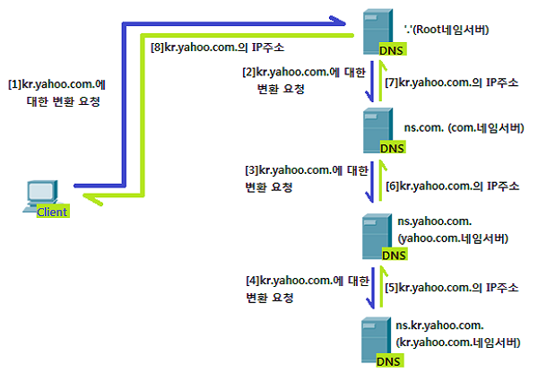
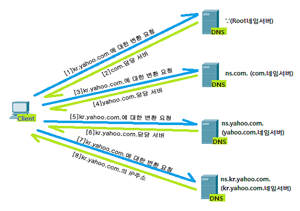

# 도메인 네임과 서버
- 일반적으로 상대 host 특정을 위해 IP adress 보다 domain name을 더 많이 사용함.

### domain name
- host IP 주소와 대응되는 문자열 형태의 host 정보
- name server (DNS server)에서 관리. 전화번호부와 비슷한 역할 수행

### domain name의 계층 분리
- **.** 으로 계층을 분리함
- root domain -> TLD(Top Level Domain) -> Second level domain -> ... 
- domain은 계층적 형태를 지님.
- ex) www.example.com. (3rd-level.2nd-level.TLD.root-domain)

### 계층적 name server
- local name server
    - client와 맞닿아 있는 name server
    - client가 domain name을 통해 IP를 알아내기 위해 처음으로 찾는 name server
    - 일반적으로 ISP에서 할당해 주는 경우가 많음
    - public DNS Server를 이용할 수도 있음.
- root name server
    - local name server가 domain name의 IP 주소를 모를 때 질의하는 Server
    - root domain을 관장하는 name server. 질의를 받으면 TLD name server IP 변환
- TLD name server
    - TLD를 관리하는 name server
    - 질의에 의해 TLD의 하위 domain name을 관리하는 name server 주소 반환
- authoritative name server (책임 네임 서버) 
    - Zone(특정 도메인 영역)을 관리하는 name server
    - 자신의 zone에 대하여 다른 name server에 넘기지 않고 바로 답할 수 있는 server
    - local name server가 마지막으로 질의하는 server

-> 전체적으로 계층적 구조를 가지고 있음

Recursive Query(재귀적 질의) & Iterative Query(반복적 질의)

Recursive Query

Iterative Query

- 항상 name server가 8단계를 거치게 될 경우, 서버의 과부하가 올 수 있음.
    - 기존 응답 결과를 임시 저장했다가 추후 동일한 질의에 활용하는 방법이 있음 (DNS Cache)
    - 짧은 시간 내 응답 가능. 일정 시간(TTL, Time To Live) 이후 삭제됨

# 자원을 식별하는 URI
- 자원 : 네트워크 상의 메시리를 통해 주고받는 대상. HTTP 요청 메시지의 대상
### URI (Uniform Resource Identifier) 
- 자원을 식별할 수 있는 정보. 자원을 식별하는 특별한 방식
    - URL(Uniform Resource Locator) : 위치를 이용한 자원 식별
    - URN(Uniform Resource Name) : 이름을 이용한 자원 식별

### URL
- 오늘날 인터넷 환경에서 자원 식별에 더 많이 사용되는 방식.
- 구성요소 : Scheme, Authority, Path, Query, Fragment
    
    1. schema : 자원에 접근하는 방법
    2. Authority : 호스트를 특정할 수 있는 정보 (Ex. ID 주소 또는 Domain name)
    3. Path : 자원이 위치한 경로. 슬래시(/) 기준으로 계층적으로 표현
    4. Query : 경로만으로 파악할 수 없는 정보에 대해 표현하는 문자열
    5. Fragment : 자원을 가리기 위한 조각.

### URN
- 자원의 위치와 상관없이 자원에 고유한 이름을 붙여 사용하는 식별자

# HTTP
- HTTP의 특성
    1. 요청-응답 기반 동작
    2. 미디어 독립적
    3. 상태를 유지하지 않음
    4. 지속 연결을 지원

1. 요청 - 응답 기반 프로토콜
    - 클라이언트와 서버 에서 클라이언트가 요청 메시지를 전송하면 그에 대한 응답 메시지를 받는 구조로 동작.
2. 미디어 독립적 프로토콜
    - 주고받을 자원의 특성과 무관하게 그저 자원을 주고 받을 수단(인터페이스)의 역할 만을 수행.
    - 슬래시를 기준으로 하는 타입/서브타입 유형으로 구성됨.
        - 타입 : 데이터의 유형을 나타냄
        - 서브타입 : 주어진 타입에 대한 세부 유형을 나타냄.
    - 미디어의 유형은 매우 다양하며, 필요에 따라 새로운 미디어 타입을 등록할 수 있음. 
3. Stateless Protocol
    - 서버가 HTTP 요청을 보낸 클라이언트와 관련된 상태를 기억하지 않음. : 클라이언트의 모든 HTTP 요청은 기본적으로 독립적인 요청으로 간주됨.
    - 일반적으로 서버는 많은 클라이언트와 동시에 상호작용 하게 되는데, 이를 모두 기억하면 서버에 많은 부담을 주게 됨.
    - 클라이언트의 상태를 기억하게 되면 특정 클라이언트가 특정 서버에 종속될 수 있어 해당 서버가 문제가 생길 경우, 통신 내역을 잃어버리는 상황이 발생할 수 있음.
        
        -> 확장성과 견고성에 유리함.
4. 지속 연결 프로토콜.
    - 현재 사용되는 HTTP 1.1 버전 이상은 Persistent connection (지속 연결, Keep Alive) 기술 제공
    - 하나의 TCP 연결 상태에서 여러 개의 요청-응답을 주고받을 수 있는 기술.
    - 한번 TCP 연결을 한 뒤 연결 종료할 때 까지 지속적으로 요청-응답을 주고 받을 수 있음.

### HTTP 메시지 구조
- 시작 라인, 필드 라인, 메시지 본문으로 이루어져 있음.

1. 시작 라인
- HTTP 메시지의 상태 (요청 메시지 - 요청 라인, 응답 메시지 - 상태 라인)을 표시
- 메서드 (공백) 요청대상 (공백) HTTP 버전 (줄바꿈) 형태로 이루어짐.

    - 메서드 
        - 클라이언트가 서버의 자원에 대해 수행할 작업의 종류 (GET, POST, PUT, DELETE 등)

    - 요청 대상
        - HTTP 요청을 보낼 서버의 자원을 의미
        - 쿼리가 포함된 URI의 경로 표시 
        - Ex) "http://www.example.com/hello?q=world"을 보낼 경우, 요청 대상은 '/hello?q=world'가 됨.

    - HTTP 버전
        - HTTP 1.1 버전의 경우 HTTP/1.1으로 표기됨.

2. 상태 라인
- HTTP 버전, 상태 코드, 이유 구문 모두 공백으로 구성됨
- 상태 코드 : 요청에 대한 결과를 나타내는 세자리 정수. 
- 이유 구문 : 상태 코드에 대한 문자열 형태의 설명

3. 필드 라인
- 0개 이상의 HTTP Header가 명시 (Header Line)
- 각 HTTP 헤더는 콜론(:)을 기준으로 헤더 이름 과 하나 이상의 헤더 값으로 구성.
- 요청 또는 응답 메시지에서 본문이 필요할 경우, 메시지 본문이 명시 됨.

### HTTP 메서드
- GET : 클라이언트가 서버에게 특정 자원을 요청하는 것.
- HEAD : GET과 비슷한 역할을 하지만 메시지 본문을 포함하지 않은 헤더만 요청
- POST : 서버로 하여금 특정 작업을 처리하도록 요청하는 메서드.
- PUT : 덮어 쓰기를 요청하는 메서드. 
    - 요청한 자원이 없을 경우, 새로운 자원 생성
    - 이미 존재하는 자원의 경우 전송한 메시지 본문으로 기존 자원을 대체하는 메서드
- PATCH : 자원의 일부분을 수정하는 메서드.
- DELETE : 특정 자원을 삭제하도록 요청하는 메서드.
