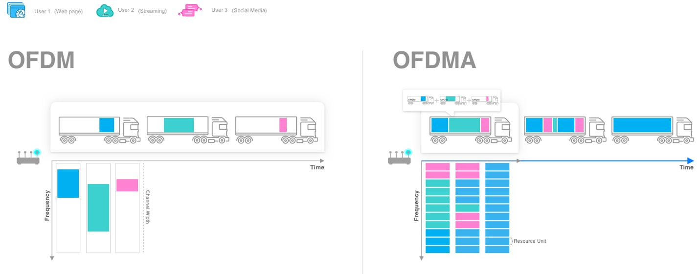
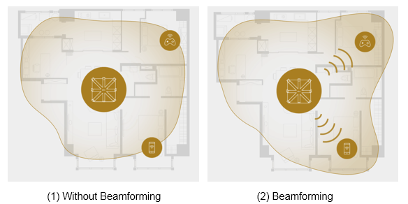
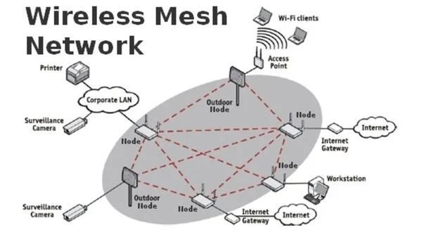

# 네트워크 분산 처리 기법

### OFDMA (Orthogonal Frequency Division Multiple Access)
- 정의
    - 하나의 넓은 채널을 여러개의 작은 주파수 단위 (Resource Unit)로 나눔
    - 각 클라이언트에게 특정 시간, 특정 주파수 범위 할당

- 구성요소
    - Subcarrier : 전체 대역폭을 나누는 작은 주파수 단위. 직교성을 가져서 상호 간섭이 최소화됨
    - Resource Block : 시간-주파수 도메인에서의 자원 할당 단위, 여러개의 연속된 부반송파와 OFDM 심볼로 구성
    - Scheduler : 사용자의 요구사항과 채널 상태에 따라 리소스 블록을 동적으로 할당

- 장점
    - 주파수 효율성 증가 : 사용자별로 Subcarrier 할당 가능
    - 유연한 자원 할당 : 사용자의 요구에 따라 동적 할당 가능
    - 지연시간 감소 : 소량의 데이터도 즉시 전송 가능

### Beamforming 
- 정의
    - 여러 안테나 신호를 조절하여 특정 방향으로 전파를 집중시키는 기술

- 방법
    - 파동의 간섭 현상을 이용하여 원하는 방향으로 보강간섭, 다른 방향으로 상쇄간섭을 일으킴

- 종류
    - 디지털 빔포밍 : 신호처리 단계에서 소프트웨어적으로 빔을 형성
    - 아날로그 빔포밍 : 하드웨어 단계에서 위상 변위기를 사용해 빔을 형성

- 장점
    - 신호 강도 향상 : 원하는 방향으로 신호를 집중시켜 강도를 높임
    - 간섭 감소 : 불필요한 방향으로 신호를 줄여 간섭을 최소화
    - 통신 범위 확대 : 신호를 멀리 보낼 수 있어 커버리지가 늘어남
    - 에너지 효율성 : 신호를 집중시켜 전력소비를 줄임

### Mesh Network
- 정의
    - 여러 네트워크 노드가 서로 연결되어 데이터를 라우팅하는 네트워크 토폴로지
    - 각 노드가 데이터를 수신, 전송 및 중계할 수 있는 구조

- 유형

    - Full Mesh : 모든 노드가 서로 직접 연결
    - Partial Mesh : 일부 노드만 서로 연결되고 나머지는 이들을 통해 연결

- 작동 원리
    - 데이터 페킷을 여러 가능한 경로 중 최적의 경로를 통해 목적지로 전달
    - 각 노드는 라우팅 테이블을 유지하며, 네트워크 상태에 따라 동적으로 업데이트
    - 자체 구성 : 새로운 노드가 자동으로 네트워크에 통합됨
    - 자체 복구 : 노드 장애시 다른 경로를 통해 데이터를 우회 전송함

- 장점

    - 노드를 쉽게 추가하여 네트워크 범위 확장 가능
    - 여러 경로로 인한 내결함성 제공
    - 동적 라우팅으로 네트워크 변화에 적응
    - 넓은 커버리지를 통해 기존 인프라의 제약 극복
    - 중앙 집중식 인프라에 비해 설치 및 유지보수 비용이 낮을 수 있음

- 단점
    - 관리와 문제 해결이 더 복잡할 수 있음
    - 여러 홉을 거치면서 지연이 증가할 수 있음

