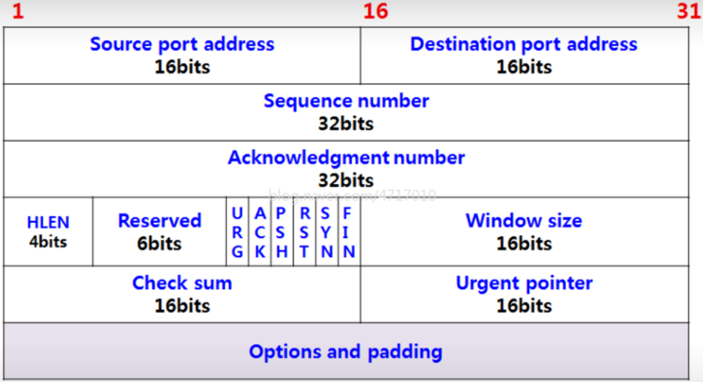

# 8주차

### TCP 분석

TCP 연결 수립 

TCP 세그먼트 구조

- 순서 번호: 초기 순서 번호 + 송신한 바이트 수 (초기 순서 번호 + 앞으로부터 떨어진 바이트 수)
- 확인 응답 번호: 순서 번호에 대한 응답, 수신자가 다음으로 받기를 기대하는 순서 번호
- Flag (제어비트) :
    
    ① **ACK**: 세그먼크의 승인을 나타내기 위한 비트
    
    ② **SYN**: 연결을 수립하기 위한 비트
    
    ③ **FIN**: 연결을 종료하기 위한 비트
    

송신지 포트: 52295

수신지 포트: 443

순서 번호: 2370613957

확인 응답 번호: 0

Flag : 0x002 (SYN) → 연결 시작 알림

송신지 포트: 443

수신지 포트: 52295

순서 번호: 548143505

확인 응답 번호: 2370613958 → 이전 패킷의 순서 번호 + 1 (클라이언트가 보낸 SYN 비트)

Flag: 0x012 (SYN, ACK) → 클라이언트의 SYN을 받았음을 확인하는 ACK 보냄

송신지 포트: 52295

수신지 포트: 443

순서 번호: 2370613958 → 이전 패킷의 확인 응답 번호에 해당하는 순서 번호를 전송

확인 응답 번호: 548143506 → 이전 패킷의 순서 번호 + 1 (서버가 보낸 SYN)

Flag: 0x010 (ACK) → 서버의 SYN에 대한 ACK 보냄